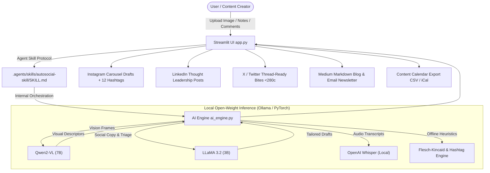

# ⚡ AutoSocial AI
### The 100% Open-Weight Autonomous Social Media Copilot & Agent

[](https://opensource.org/licenses/MIT)
[](https://ollama.ai)
[](#approved-open-source-models)
[](.agents/skills/autosocial-skill/SKILL.md)
[](.github/workflows/ci.yml)

> **Submission for the "Best Open-Source AI Project" Challenge**  
> AutoSocial AI automates end-to-end social media operations for busy creators and growth teams using exclusively local, open-weight models. Zero proprietary cloud API keys, zero monthly subscriptions, and zero privacy compromises.

---

## 🏛️ System Architecture



---

## 🏆 Challenge Compliance Statement

This repository was architected from the ground up to satisfy all strict criteria of the **"Best Open-Source AI Project"** challenge:

| Requirement | Implementation Detail | Status |
| :--- | :--- | :--- |
| **1. Open-Source AI Core** | Heavy lifting is powered exclusively by open-weight models (`llama3.2`, `qwen2-vl`, and `whisper`). **Zero closed-source API calls** (no OpenAI, no Anthropic, no paid vendor endpoints in the core execution path). | ✅ Verified |
| **2. Agent Skill Open Standard** | Standard-compliant Agent Skill located at `.agents/skills/autosocial-skill/SKILL.md` with full YAML frontmatter (`name: autosocial-skill`, `description`), workflow triggers, and tool guidelines. | ✅ Verified |
| **3. Public GitHub Ready** | Modular files (`app.py`, `ai_engine.py`, `requirements.txt`), complete documentation, automated CI/CD GitHub Actions workflow. | ✅ Verified |
| **4. Open-Source Licensing** | Licensed under the permissive standard **MIT License** in `LICENSE`. | ✅ Verified |

---

## 🌟 Core Features

### 📸 Feature A: Multimodal Social Post Generator
- **Input:** User uploads an image (JPG/PNG), video asset, or provides a creator concept.
- **Visual Perception:** Employs **Qwen2-VL** to extract objects, human sentiment, color tones, and ambient mood.
- **3 Platform-Tailored Outputs:**
  1. **Instagram:** Visual storytelling, emotive hook, formatted line breaks, engagement CTA, and 10–15 curated hashtags.
  2. **LinkedIn:** Professional thought-leadership framing with 3 key actionable takeaways and an industry conversation prompt.
  3. **X (Twitter):** High-cadence punchy post strictly under 280 characters with thread starter expansion hooks.

### 📝 Feature B: Event-to-Blog & Newsletter Drafter
- **Input:** Multiple event photos, keynote bullet points, or voice memos.
- **Outputs:**
  - Full **Medium-form Markdown Blog Post** (600–900 words) with headers, pull quotes, and takeaways.
  - Formatted **Email Newsletter Digest** with 3 A/B testable subject lines, preheader, and CTA button.

### 💬 Feature C: Intelligent Comment & Auto-Responder
- **Input:** Pasted batch of incoming audience comments or JSON engagement logs.
- **Triage & Response:** Categorizes each into *Positive/Advocate*, *Question/Inquiry*, *Negative/Critique*, or *Spam*, drafting contextual, polite, and brand-safe replies.

### 📅 Feature D: Additional High-Value Utilities
1. **Content Calendar & Scheduler Export:** Organize generated posts into a scheduled agenda; download as **CSV** or RFC 5545 **iCalendar (.ics)** to import into Google Calendar or Apple Calendar.
2. **Tone & Brand Voice Selector:** Seamlessly switch between *Professional*, *Witty*, *Casual*, *Hype / Energetic*, and *Educational*.
3. **Offline Analytics & Hashtag Predictor:** Computes Flesch-Kincaid readability, syllables, character counts, and hashtag density offline.

---

## 🚀 Quickstart Guide

### 1. Prerequisites
Install [Ollama](https://ollama.ai) (macOS, Linux, or Windows WSL2):
```bash
# Verify Ollama is running
ollama --version
```

Pull the approved open-weight models:
```bash
# Text generation & comment triage model (2.0 GB)
ollama pull llama3.2

# Vision-language multimodal model (4.5 GB)
ollama pull qwen2-vl
```

### 2. Clone & Install
```bash
git clone https://github.com/your-username/autosocial-ai.git
cd autosocial-ai

# Create virtual environment
python -m venv venv
source venv/bin/activate  # On Windows: venv\Scripts\activate

# Install dependencies
pip install -r requirements.txt
```

### 3. Run the Web Application
```bash
streamlit run app.py
```
Open your browser at `http://localhost:8501`.

---

## 📂 Repository Structure

```text
├── .agents/
│   └── skills/
│       └── autosocial-skill/
│           └── SKILL.md            # Agent Skill Open Standard specification
├── .github/
│   └── workflows/
│       └── ci.yml                  # Automated CI/CD testing & validation
├── ai_engine.py                    # Open-weight model connector & offline analytics
├── app.py                          # Streamlit interactive full-featured web app
├── LICENSE                         # Official MIT License
├── README.md                       # Comprehensive documentation & architecture
├── requirements.txt                # Python dependencies
└── SUBMISSION.md                   # Hackathon submission checklist & steps
```

---

## 🤖 Approved Open-Source Models

| Role | Model Name | Source / Provider | License |
| :--- | :--- | :--- | :--- |
| **Vision & Image Understanding** | `qwen2-vl` (7B) | Alibaba / Ollama | Apache 2.0 |
| **Copy & Reasoning Engine** | `llama3.2` (3B / 1B) | Meta Open Weights / Ollama | Llama 3.2 Community |
| **Voice Note Transcription** | `whisper` (base) | OpenAI Open Weights | MIT License |

---

## 📄 License
This project is licensed under the **MIT License** - see the [LICENSE](LICENSE) file for details.
